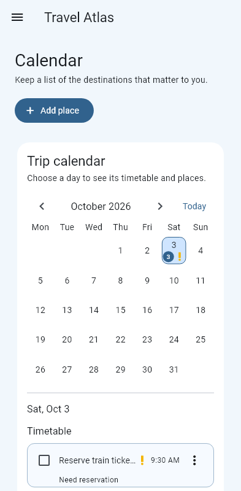
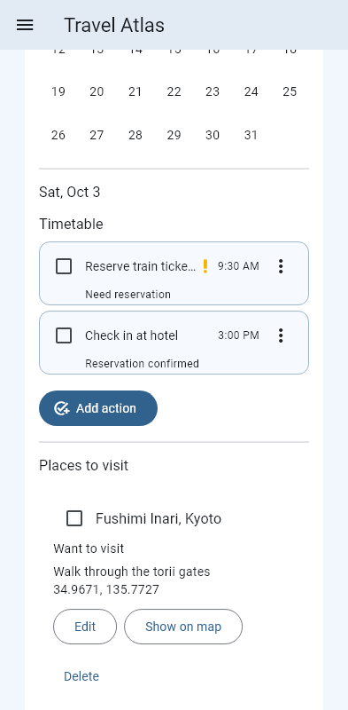

# Travel Atlas

A Flutter travel planner for places, daily actions, documents, and visa preparation. Trip data is saved on your device.

## Download for Android

**[Download the latest Android APK](https://github.com/IsAyka1/travel-app/releases/latest/download/TravelAtlas-Android.apk)**

Open the downloaded APK on your phone and allow installation from your browser or file manager if Android asks. The APK is a universal build for Android devices, including Xiaomi phones. It is currently signed with a development key, so a future build signed with another key may require uninstalling this one first. Export your trip from **Share trips** before uninstalling, because uninstalling removes locally saved data.

## Screenshots

These screenshots show example data.

| Overview | Calendar | Day plan |
| --- | --- | --- |
|  |  |  |

## Features

- Save places from map search or a map location, plan a visit date, and mark places visited.
- Use the calendar to plan actions by day. Actions can have a time, linked place, reservation status, and imported attachment. Days with a needed reservation show a yellow exclamation mark.
- Keep tickets, itineraries, and other files in the app and preview supported documents.
- Track visa requirements and preparation checklists by destination.
- Export and import a trip package through **Share trips**.
- Open Calendar, Files, or Visa directly from the Overview summary tiles.

Map tiles and place search require internet access. Search uses the Photon public demo service, which is intended for modest use and has no uptime guarantee.

## Run from source

```sh
flutter pub get
flutter run
```

Imported files are stored in the app documents directory under `travel_app/files`. File metadata is in `travel_app/files.json`; saved places and actions use `shared_preferences`. Removing an imported file does not delete its original source file.
